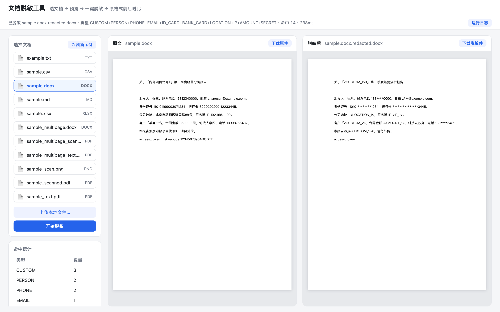
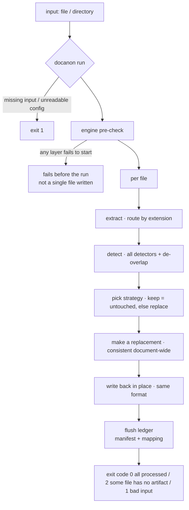
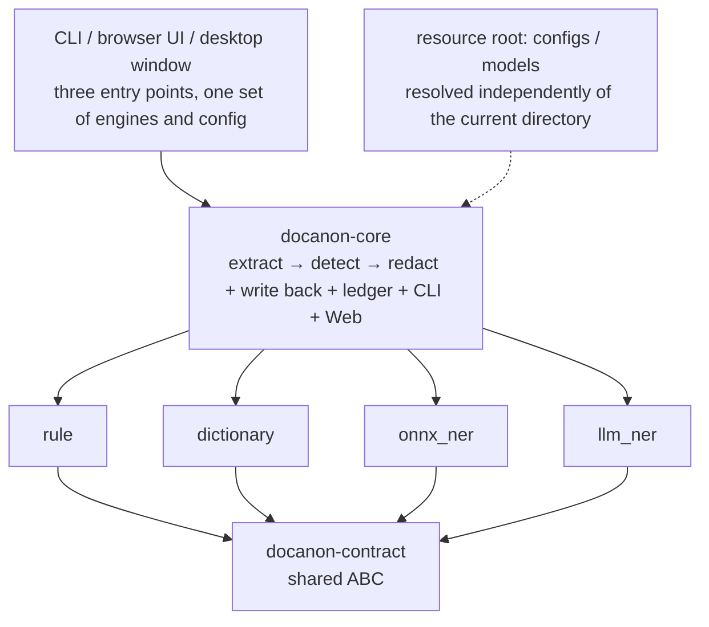

<h1 align="center">doc-anonymizer</h1>

<p align="center"><b>Local document redaction</b> · Chinese-first · fully offline · keeps the original format</p>

<p align="center">
  <a href="https://lawyerch-dev.github.io/doc-anonymizer/"></a>
  
  
  
  
</p>

<p align="center">
  <a href="https://lawyerch-dev.github.io/doc-anonymizer/"><b>Online docs</b></a> ·
  <a href="#quick-start">Quick start</a> ·
  <a href="CONTRIBUTING.en.md">Contributing</a> ·
  <a href=".github/SECURITY.md">Security</a> ·
  <a href="README.md">中文</a>
</p>

<p align="center">
  
</p>

Person names, phone numbers (mobile and landline), ID cards, passports, license plates, bank cards,
emails, IPs, unified social credit codes, secrets, custom sensitive terms — detected and erased, emitting
**same-format** files plus a reversible mapping table.
**No network, no uploads, no cloud APIs** — the one exception being when you explicitly click
"download model", which fetches that single file from modelscope.

## Features

- **Chinese-first**: rules + a Chinese dictionary + Chinese NER (ONNX), all three working together.
- **Fully offline**: no cloud calls; the optional LLM route only talks to a local `llama-server`.
- **Keeps the original format**: docx rewritten run by run, xlsx/csv rewritten cell by cell, pdf/images blacked out — compare before and after side by side.
- **Legacy Office accepted too**: `.doc`/`.xls`/`.wps` are converted to a modern format via LibreOffice before redaction (the output format therefore changes; the ledger and UI say so).
- **Recall first**: anything uncertain is always flagged, and every hit's position and origin stay inspectable.
- **Reversible**: `mapping.json` records original ↔ replacement, and `restore` rebuilds text outputs.
- **No silently missing layer**: if an engine cannot start it fails before the run, rather than producing a result with less detection.
- **Resumable**: the ledger is flushed as soon as each file finishes, so `--resume` never redoes completed work.
- **Three ways in**: CLI / browser / desktop window, all on the same engines and config.

## Quick start

Prerequisites: Apple Silicon macOS + Python 3.11/3.12.

```bash
git clone https://github.com/lawyerch-dev/doc-anonymizer && cd doc-anonymizer
npm run setup          # one-shot setup: Python venv + five packages + preview assets + npm install
npm run dev            # product UI: backend + Vite dev (hot reload) → http://127.0.0.1:5173
npm run dev:website    # website/docs site → http://127.0.0.1:4321
npm test               # one-shot full test run (all Python + component library checks + docs site build)
```

**npm scripts are the entry points** (`scripts/dev.sh` is the implementation layer they call):

| Command | What it does |
|---|---|
| `npm run setup` | idempotent environment setup; `npm run doctor` tells you what is missing and why it cannot start |
| `npm run dev` / `dev:website` / `dev:desktop` | product UI / website & docs site / desktop shell |
| `npm run dev:backend` | backend for the product UI only (production shape: `npm run build:web && npm run dev:backend`) |
| `npm test` | one-shot full test run (`test:py` runs Python only, `test:web` runs the frontend only) |
| `npm run test:strict` | anti-false-green: once the environment is declared complete, **any skip counts as a failure** (run it after installing models, see `docs/cookbook/reviewing-a-change.md`) |
| `npm run check:scope` | works out the **smallest** set of checks your change needs (not a blanket full run) |
| `npm run build:web` | build the product UI → `apps/web/dist/` (served statically by `docanon web`) |
| `npm run build` | build the static site → `website/dist/` |
| `npm run cli -- <args>` | call docanon directly (mind npm's `--`) |
| `npm run engines` / `models` / `doctor` | engine self-check / fetch models / environment self-check |

`npm run models` fetches the Chinese NER model that `configs/onnx.yaml` asks for (about 830MB; the official
huggingface.co is unreachable on some networks, so the script defaults to `hf-mirror.com`, and `HF_ENDPOINT`
can point elsewhere).
Step-by-step walkthrough: [docs/quickstart.en.md](docs/quickstart.en.md).

## Run flow and structure





Why the packages are split this way, the hard boundaries and the decision records: [docs/architecture.en.md](docs/architecture.en.md).

## Usage

### CLI

```bash
.venv/bin/docanon run ./samples -o var/out -c configs/onnx.yaml        # process a file or directory
.venv/bin/docanon run ./案件 -o var/out -c configs/onnx.yaml --resume  # resume after an interruption
.venv/bin/docanon engines -c configs/onnx.yaml                         # how many detection layers this config runs
.venv/bin/docanon restore var/out/sample.md.redacted.md --mapping var/out/mapping.json
```

Exit codes: `0` everything processed · `1` bad input/config/engine (not a single file is written) · `2` some
files produced no result (unsupported format / failed extraction / interrupted) — `2` is a heads-up, not a crash.

### Web UI

```bash
./scripts/fetch_file_viewer.sh                       # first run: preview assets (232MB, gitignored)
.venv/bin/docanon web -p 8000 -c configs/onnx.yaml
```

Pick a sample or upload → preview the original → redact → compare side by side + hit counts; the "Run log"
traces every hit back to its source (which engine, where, what matched, what it was replaced with). It listens
on `127.0.0.1` only, with no auth (for local, single-user use).

**The redaction scheme is layered in three levels** (progressive disclosure — casual users only ever touch L1):

- **L1 scheme**: choose one of the four built-ins (`configs/*.yaml`, read-only) or **my configs**
  (`var/configs/<name>.yaml`). The dropdown lists only a **short name** (e.g. "Most accurate (local LLM)");
  "when to use which" is shown on its own line underneath — both come from the **first two comment lines** of
  each yaml (edit the wording in the file and the UI follows), while anything below them is detail for whoever
  edits the config and never reaches users. Create / save-as / export / import.
- **L2 custom redaction**: per-type strategy (shown in plain language, e.g. "blank out with `**`"; maps to
  `redact` / `mask` / `placeholder` / `pseudonym` / `remove` / `keep`, each row with a worked example) + custom
  sensitive words; the "use pseudonyms for people/orgs" switch merely flips the matrix between `redact` and
  `pseudonym` (it introduces no second representation).
- **L3 detection engines**: this layer answers exactly one question — **should a model recognise names,
  organizations and addresses**: no model / the local small model / the local LLM ("both" only appears when the
  current config already uses both). Choose a model and only then do the catalogue (`configs/llm_models.yaml`)
  and "which LLM" show up: **click one and it is used**; if it is not installed the download starts on its own
  (progress, cancel, resumes if interrupted). Starting the server is the app's job (it brings `llama-server` up
  before the run and swaps it when you switch models) — no terminal, no address, no alias. Fixed-format numbers,
  emails and your own word list are **always on** (they need no model and there is no reason to turn them off):
  to leave one kind alone, set its strategy to `keep` in L2 — don't switch off an engine (that silently drops
  detections).

Edit and **try a run inline with the current editor contents** (no need to save first); name and save or export
once happy. Engine pre-check runs at run time — a missing model / unreachable LLM returns 400 + a reason
(never silently dropping a layer); the list endpoint does **not** pre-check (so it never loads ONNX each call).
User configs share the built-in schema and live in the gitignored `var/configs/`; **built-ins are read-only**
(no edit, no delete).

Endpoints: `/` `/assets/*` `/health` `/api/presets` `/api/configs` `/api/configs/{ref}` `/api/models`
`/api/models/download` `/api/upload` `/api/anonymize` (plus `PUT`/`DELETE /api/configs/{name}`,
`POST /api/configs/import`, `GET /api/configs/{name}/export`, `POST /api/models/download/cancel`).
`/api/configs` lists built-ins and user configs and marks the current one; `/api/models` reports the ONNX
dirs, the LLM defaults and the **downloadable model catalogue**; `/api/models/download` starts / polls /
cancels the in-app model download (it takes a catalogue `id` only, **never a URL**); `/api/upload` takes `{filename, content_b64}`;
`/api/anonymize` takes `{preset|token, config?}`, where `config` is a **config name** or an **inline object**,
and returns `counts` and `trace`; uploads are capped at 50MB.

### Website & docs site (optional)

```bash
npm run dev:website        # → http://127.0.0.1:4321 (runs npm install automatically on first use)
npm run build              # static output into website/dist/, servable by any static host
```

Deploying to GitHub Pages: Settings → Pages → Source, pick **GitHub Actions**; from then on a push to `main`
runs [`.github/workflows/deploy-website.yml`](.github/workflows/deploy-website.yml), which passes the gates
before publishing (this is the repo's only CI, running the deployment-related gates: doc drift + package
boundaries + component library checks + site build; the full engine test suite stays local via `npm test`).
Sub-path deployments need `SITE_BASE=/<repo-name> SITE_URL=https://<username>.github.io`; the full steps and
how to verify them are in [`docs/cookbook/shipping-the-website.md`](docs/cookbook/shipping-the-website.md).

Astro 5 + Starlight (search/TOC/prev-next built in), with content coming straight from this repo's markdown
(manifest `website/content-manifest.json`); components live in the shared library [`packages/ui`](packages/ui/README.md)
(`@doc-anonymizer/ui`: velora **100 components + 31 blocks** + shadcn primitives, MIT), and
**whenever the product frontend changes stacks it imports that same package**, so the look and the components
never fork. The catalog is on the site under "Development → Component library overview".
For details, the measured framework comparison, and pitfalls, see [website/README.md](website/README.md).

### Desktop shell (optional)

```bash
cd apps/desktop && hutch install && npm start   # system WebView, :8770
```

See [apps/desktop/README.md](apps/desktop/README.md).

## Supported formats & outputs

| Input | Output | How it is redacted |
|---|---|---|
| `.docx` | `x.docx.redacted.docx` | text rewritten run by run (hyperlinks, content controls, nested tables included), formatting kept |
| `.xlsx` / `.csv` | `x.xlsx.redacted.xlsx` | cells rewritten, keeping sheet structure |
| `.doc` / `.xls` / `.wps` (legacy Office) | `x.doc.redacted.docx` | converted to `.docx`/`.xlsx` by LibreOffice first, then redacted; **the output format changes and the layout may be reflowed** |
| `.pdf` (text layer) | `x.pdf.redacted.pdf` | hit pages blacked out (**the page becomes a bitmap**) |
| `.pdf` (scan) / `.png` `.jpg` `.tiff` … | same as above / `x.png.redacted.png` | OCR locates the text, then black boxes are drawn proportionally to character width |
| `.txt` / `.md` | `x.txt.redacted.txt` | line-by-line plain-text replacement |

Files are named `<full name>.redacted.<original extension>`, keeping relative subdirectories. The `-o`
directory holds two ledgers (accumulated per source file, so you can run in batches):

- `manifest.json` — `ok` / `error` / `unsupported` per file. **Only `ok` files were redacted.**
- `mapping.json` — original ↔ replacement. **Never send it out or commit it alongside the redacted files.**

## Configuration

`configs/`: `legal.yaml` (**delivery preset for legal documents**: redacts only identifiers and contact
details such as ID numbers, bank cards, phones and addresses; courts, case numbers, judges and clerks, party
names, law firms and agents, dates and amounts are all left alone) · `default.yaml` (rules + dictionary) ·
`onnx.yaml` (+ Chinese NER, swaps names and organizations too — for talks and case write-ups) ·
`llm.yaml` (+ a local LLM; pick one in the UI and the server is started for you before the run).
There is also `llm_models.yaml` — the **downloadable model catalogue**, not a redaction preset: each entry
carries a name, one line of when-to-use, the repo and the filename, and the UI's "local LLM" section turns it
into a picker (selecting installs and uses it). Add your own models by editing that file (see the
[design](docs/specs/2026-10-09-llm-model-download-design.md)).

**Use `legal.yaml` for delivery**: `onnx.yaml` treats the court as an organization, "审判员" and
"委托诉讼代理人" as roles, and the judgment date as a date of birth — redacts them all, and the document can
no longer be filed (measured). List what you want redacted; every type you do not list stays `keep` ("only
what I name gets touched"). Hits that were identified but kept by config are listed separately in the web run log.

- Strategies are configured per entity type: `redact` (**replaces the whole span with `**`** — the default, so
  nothing believable is ever produced) / `mask` (`138****0000`) / `placeholder` (`<PHONE_1>`) /
  `pseudonym` (a stable fake name per entity of the same kind — **only when you ask for it**) / `remove`
  (delete outright) / `keep` (**leave it alone** — it exists so a config can say "don't touch this class").
  Names, organizations and custom terms default to `redact` (`**`), not a believable fake company. Custom terms
  go under `dictionary` and are tagged `CUSTOM`.
- Relative paths in config (e.g. `onnx.model_dirs`) resolve against the **resource root** (found by walking up
  from `configs/default.yaml`; override it with `DOCANON_ROOT`) and are independent of the cwd; input/output
  paths given on the command line resolve against the cwd.

## Detection engines

| Engine | What it does | Depends on |
|---|---|---|
| `rule` | ID cards / phones (mobile and landline) / passports / license plates / bank cards / emails / IPs / unified social credit codes / secrets / amounts | nothing |
| `dictionary` | custom business-sensitive terms → `CUSTOM` | nothing |
| `onnx_ner` | Chinese NER (person names / organizations / addresses, …), 34ms per item, no server needed | `var/models/onnx/*` |
| `llm_ner` | local LLM NER that takes instructions and generates natural-looking fake names | `llama-server` + GGUF (started for you in the web UI; start it yourself for the CLI) |

`docanon engines` reports whether each layer is available (with the reason) and what it can actually do;
for choosing between them, and for benchmark numbers, see [docs/benchmarks.md](docs/benchmarks.md).

## Known limitations

- **A hit PDF page becomes a full-page bitmap** (the text layer is gone — nothing to select, search, or edit again).
  This is a security guarantee: blacking out the text layer would still leave the original copyable. Pages without
  hits are kept as they are.
- docx **headers, footers, footnotes, and text boxes are not extracted** (body paragraphs, hyperlinks, content
  controls, and tables — nested ones included — are covered).
- docx **document properties are left untouched**: metadata such as the author name in `docProps` survives
  (measured — the body is redacted while the property still carries the name).
- A sensitive value that exists **only in a link target and is never shown in the body** is not detected; values
  that do appear in the body are scrubbed from the `mailto:`/URL as well, but an email or token travelling purely
  inside a URL is out of scope.
- `restore` only supports text outputs (txt/md/csv); text deleted by `remove` has no anchor left, so it cannot be restored.
- After masking, values that look the same (two numbers masked identically) restore to the wrong original text.
- `.doc` / `.xls` / `.wps` are converted to `.docx`/`.xlsx` and then redacted (LibreOffice required): check the
  `soffice` line in `npm run doctor`, and fetch it with `./scripts/fetch_libreoffice.sh` if missing. The output
  format therefore becomes `.docx`/`.xlsx`, and **the layout may be reflowed — review by hand before delivery**;
  without LibreOffice the file is recorded as `unsupported` (exit code 2). To turn the conversion off, set
  `legacy_convert: false`. GBK CSVs must be converted to UTF-8 first.
- The output directory must not live inside the input directory, or the next run will treat the previous run's
  `.redacted.*` files as new documents and redact them again.
- **It assists human review and does not guarantee zero misses**: OCR misreads and unusual spellings can slip through.
  Review by hand before delivery, especially scans and tables.

## Documentation

| I want to… | Read |
|---|---|
| a step-by-step walkthrough, common problems | [docs/quickstart.en.md](docs/quickstart.en.md) |
| to contribute (environment, tests, commits, PRs) | [CONTRIBUTING.en.md](CONTRIBUTING.en.md) |
| the contracts to read before changing code (entry point + topic rules) | [AGENTS.md](AGENTS.md) · [.agent/rules/](.agent/rules/) |
| five-package structure, hard boundaries, decision records, relocation history | [docs/architecture.en.md](docs/architecture.en.md) |
| model choice and benchmark numbers | [docs/benchmarks.md](docs/benchmarks.md) |
| the script inventory | [scripts/README.md](scripts/README.md) |
| how to change the website/docs site or the component library | [website/README.md](website/README.md) · [packages/ui/README.md](packages/ui/README.md) |
| version changes | [CHANGELOG.md](CHANGELOG.md) |
| how to report a missed redaction or another security issue | [SECURITY.md](.github/SECURITY.md) |
| the original design document (historical) | [docs/specs/2026-10-05-doc-anonymizer-design.md](docs/specs/2026-10-05-doc-anonymizer-design.md) |
| the legacy-format auto-conversion design and decision | [design](docs/specs/2026-10-08-legacy-office-conversion-design.md) · [decision note](.agent/notes/implemented/feature/2026-10-08-legacy-office-conversion.md) |
| the layered web redaction-config design and decision | [design](docs/specs/2026-10-08-redaction-config-design.md) · [decision note](.agent/notes/implemented/feature/2026-10-08-web-redaction-config.md) |

[MIT](LICENSE) © 2026 [LawyerCH](https://github.com/LawyerCH) ·
thanks to [RapidOCR](https://github.com/RapidAI/RapidOCR), [pypdfium2](https://github.com/pypdfium2-team/pypdfium2),
[python-docx](https://github.com/python-openxml/python-docx), [openpyxl](https://foss.heptapod.net/openpyxl/openpyxl),
[llama.cpp](https://github.com/ggml-org/llama.cpp), [file-viewer](https://github.com/flyfish-dev/file-viewer),
[Electrobun](https://github.com/blackboardsh/electrobun), [velora-ui](https://github.com/ColorlibHQ/velora-ui)
