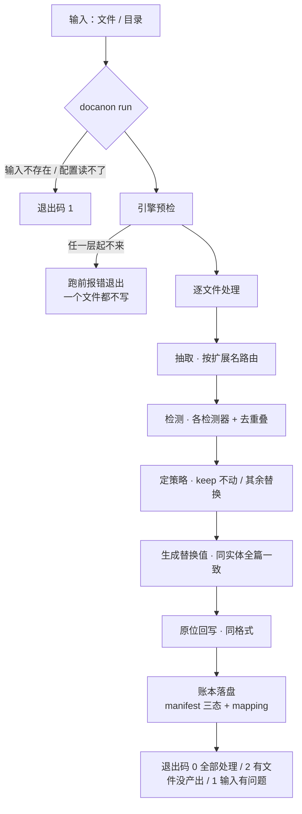
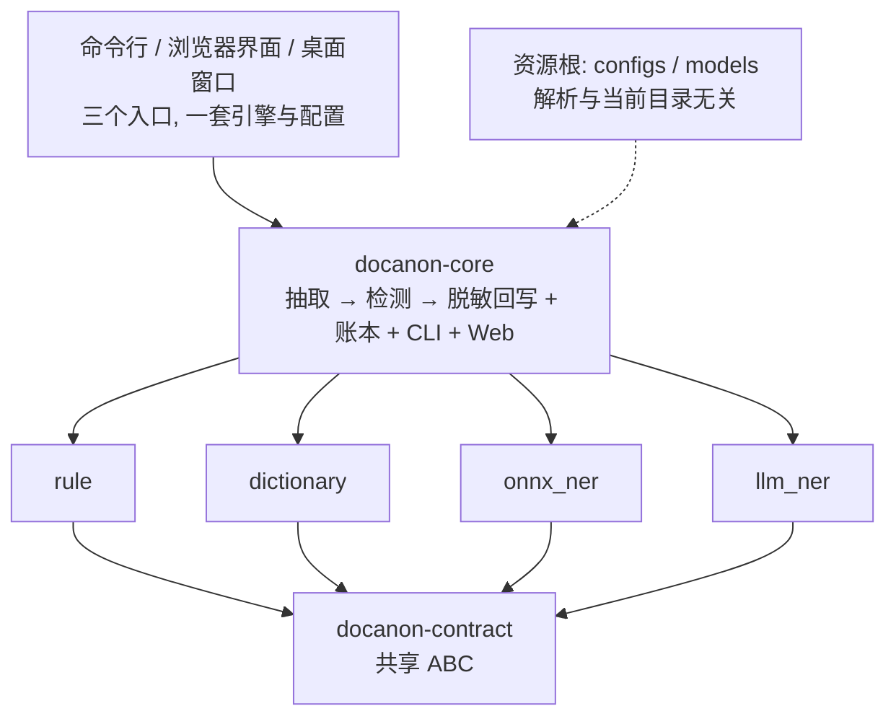

<h1 align="center">doc-anonymizer</h1>

<p align="center"><b>本地文档脱敏</b> · 中文优先 · 全离线 · 保留原格式</p>

<p align="center">
  <a href="https://lawyerch-dev.github.io/doc-anonymizer/"></a>
  
  
  
  
</p>

<p align="center">
  <a href="https://lawyerch-dev.github.io/doc-anonymizer/"><b>在线文档</b></a> ·
  <a href="#快速上手">快速上手</a> ·
  <a href="CONTRIBUTING.md">参与开发</a> ·
  <a href=".github/SECURITY.md">安全问题</a> ·
  <a href="README.en.md">English</a>
</p>

<p align="center">
  
</p>

人名、手机号（含座机）、身份证、护照、车牌、银行卡、邮箱、IP、统一社会信用代码、密钥、自定义敏感词
—— 识别并抹掉，输出**同格式**文件 + 可还原对照表。**不联网、不上传、不依赖云端 API**
（唯一例外：你主动点「下载模型」时，才会去 modelscope 取你要的那一个文件）。

## 特性

- **中文优先**：规则 + 中文词典 + 中文 NER（ONNX）三路并用。
- **全离线**：无云端调用；可选的 LLM 路线也只连本机 `llama-server`。
- **保留原格式**：docx 按 run 改写、xlsx/csv 改单元格、pdf/图片涂黑，前后可左右对照。
- **旧版 Office 也收**：`.doc`/`.xls`/`.wps` 自动经 LibreOffice 转成现代格式再脱敏（产物格式随之改变，账本与界面会标明）。
- **召回优先**：拿不准的一律标出，命中位置与来源可查。
- **可还原**：`mapping.json` 记「原文 ↔ 替换值」，`restore` 还原文本产物。
- **不许静默少一层**：引擎起不来就在跑前报错退出，不产出"少了识别"的结果。
- **可续跑**：账本每处理完一个文件就落盘，`--resume` 不重做已完成部分。
- **三种用法**：CLI / 浏览器 / 桌面窗口，同一套引擎与配置。

## 快速上手

前置：Apple Silicon macOS + Python 3.11/3.12。

```bash
git clone https://github.com/lawyerch-dev/doc-anonymizer && cd doc-anonymizer
npm run setup          # 一键装齐: Python venv + 五个包 + 预览资源 + npm install
npm run dev            # 产品界面: 后端 + Vite dev（热更）→ http://127.0.0.1:5173
npm run dev:website    # 官网/文档站 → http://127.0.0.1:4321
npm test               # 一键全测（Python 全量 + 组件库检查 + 文档站构建）
```

**npm scripts 就是入口**（`scripts/dev.sh` 是它调用的实现层）：

| 命令 | 做什么 |
|---|---|
| `npm run setup` | 幂等装齐环境；`npm run doctor` 告诉你缺什么、为什么起不来 |
| `npm run dev` / `dev:website` / `dev:desktop` | 产品界面 / 官网文档站 / 桌面壳 |
| `npm run dev:backend` | 只起产品界面的后端（生产形态：`npm run build:web && npm run dev:backend`） |
| `npm test` | 一键全测（`test:py` 只跑 Python，`test:web` 只跑前端） |
| `npm run test:strict` | 反假绿：声明环境齐备后**任何 skip 都算失败**（装了模型再跑，见 `docs/cookbook/reviewing-a-change.md`） |
| `npm run check:scope` | 按改动范围算出**最小**该跑的检查（不是无脑全量） |
| `npm run build:web` | 构建产品界面 → `apps/web/dist/`（`docanon web` 静态发出） |
| `npm run build` | 构建静态站 → `website/dist/` |
| `npm run cli -- <参数>` | 直接调 docanon（注意 npm 的 `--`） |
| `npm run engines` / `models` / `doctor` | 引擎自检 / 取模型 / 环境自检 |

`npm run models` 取 `configs/onnx.yaml` 要的中文 NER 模型（约 830MB；官方 huggingface.co 在部分网络
不可达，脚本默认走 `hf-mirror.com`，`HF_ENDPOINT` 可换）。
逐步走一遍：[docs/quickstart.md](docs/quickstart.md)。

## 运行流程与结构





分包理由、硬边界与决策记录见 [docs/architecture.md](docs/architecture.md)。

## 用法

### 命令行

```bash
.venv/bin/docanon run ./samples -o var/out -c configs/onnx.yaml        # 处理文件或目录
.venv/bin/docanon run ./案件 -o var/out -c configs/onnx.yaml --resume  # 断了接着跑
.venv/bin/docanon engines -c configs/onnx.yaml                         # 这份配置跑了几层检测
.venv/bin/docanon restore "var/out/【脱敏版】sample.md" --mapping var/out/mapping.json
```

退出码：`0` 全部处理 · `1` 输入/配置/引擎有问题（一个文件都不写）· `2` 有文件没产出结果
（格式不支持 / 抽取失败 / 被中断）—— `2` 是提示，不是跑坏了。

### Web 界面

```bash
./scripts/fetch_file_viewer.sh                       # 首次: 预览资源(232MB, gitignore)
.venv/bin/docanon web -p 8000 -c configs/onnx.yaml
```

选示例或上传 → 预览原文 → 脱敏 → 对照预览 + 命中统计；「运行日志」给逐条溯源
（哪个引擎、在哪个位置、命中什么、替换成什么）。仅监听 `127.0.0.1`、无鉴权（本机自用）。

**脱敏方案分三层**（渐进披露，普通用户只用第一层）：

- **L1 方案**：在**内置的三套**（`configs/*.yaml`，只读）与**我的配置**（`var/configs/<名>.yaml`）间选一套
  —— 通用 / 最准 / 最快。选项里只放**短名**，"什么时候用哪套"单独显示在下面 —— 这两句就是各自 yaml 开头的
  **前两行注释**（改文案改注释，界面自动跟着变）；再往下写的是给改配置的人的细节，不会端到用户面前。
  默认停在「通用」（认得号码、人名、机构、地址，且是本机小模型、毫秒级）；可新建 / 另存为 / 导出 / 导入。
  `configs/legal.yaml`（"只抹标识与联系方式、人名机构金额全留"）仍在仓库里、仍是 CLI 的默认 `-c`，
  但**不在界面下拉中暴露**（见 `apps/web/src/lib/formats.ts` 的 `HIDDEN_SCHEMES`）。
- **L2 自定义脱敏**：逐类型策略（界面显示中文名，如"盖成 `**`"；对应 yaml 里的 `redact` / `mask` /
  `placeholder` / `pseudonym` / `remove` / `keep`，每行带效果示例）+ 自定义敏感词；「用假名替代人名/机构」
  开关只把 `redact` 与 `pseudonym` 之间批量切矩阵（不引入第二种表达）。
- **L3 检测引擎**：这一层只回答一个问题 —— **要不要用模型来认人名/机构/地址**：不用模型 / 本机小模型 /
  本地大模型（"两个都用"只在当前配置本来就是这样时才出现）。选了模型，模型清单（`configs/llm_models.yaml`）
  与"用哪个大模型"才跟着出现：**点中即用**，没装就自动开始下载（带进度、可取消、断了能续）；起服务是 app
  的事（开跑前把 `llama-server` 起好，换了模型就换掉它），不用开终端、也不用填地址或别名。
  固定写法的号码/邮箱与自定义词表**一直开着**（不靠模型，也没必要关）——"不想动某一类"请改 L2 的策略为
  「保持原样」，而不是关引擎（关引擎 = 静默漏检）。

改完**直接用当前编辑器内容内联试跑**（不必先存盘），满意再命名保存或导出。运行期做引擎预检：缺模型 /
连不上 LLM 返回 400 + 原因（不静默少一层）；列表接口**不**预检（不每次加载 ONNX）。
用户配置与内置**同 schema**，落在已 gitignore 的 `var/configs/`；**内置只读**（拒改拒删）。

接口：`/` `/assets/*` `/health` `/api/presets` `/api/configs` `/api/configs/{ref}` `/api/models`
`/api/models/download` `/api/upload` `/api/anonymize` `/api/progress/{job}`（另 `PUT`/`DELETE /api/configs/{name}`、
`POST /api/configs/import`、`GET /api/configs/{name}/export`、`POST /api/models/download/cancel`、
`POST /api/anonymize/cancel`）。
`/api/configs` 列内置+用户并标当前；`/api/models` 报可选 ONNX 目录、LLM 默认与**可下载的大模型目录**；
`/api/models/download` 起步/查询/取消界面内的模型下载（只收目录里的 `id`，**不收 URL**）；
`/api/upload` 入参 `{filename, content_b64}`；`/api/anonymize` 入参 `{preset|token, config?, job?}`，
`config` 可为**配置名**或**内联对象**，出参含 `counts` 与 `trace`；上传上限 50MB。
`job` 是界面自己生成的一个短 id：跑的时候用它读 `/api/progress/{job}`（在读原文件 / 识别第几段 / 写回），
或用 `POST /api/anonymize/cancel` 叫停 —— 取消**不产出任何文件**（半截产物比没产物更危险）。

### 官网与文档站（可选）

```bash
npm run dev:website        # → http://127.0.0.1:4321（首次自动 npm install）
npm run build              # 静态输出到 website/dist/，任意静态服务器都能发
```

部署到 GitHub Pages：Settings → Pages → Source 选 **GitHub Actions**，之后 push `main` 会由
[`.github/workflows/deploy-website.yml`](.github/workflows/deploy-website.yml) 先过门禁再发布
（这是仓库唯一的 CI，跑的是部署相关的门禁：文档漂移 + 包边界 + 组件库检查 + 站点构建；
引擎全量测试仍是本地 `npm test`）。子路径部署要 `SITE_BASE=/<仓库名> SITE_URL=https://<用户名>.github.io`，
完整步骤与验证方式见 [`docs/cookbook/shipping-the-website.md`](docs/cookbook/shipping-the-website.md)。

Astro 5 + Starlight（搜索/TOC/上下页内置），内容直接来自本仓库的 markdown
（清单 `website/content-manifest.json`）；组件在共享库 [`packages/ui`](packages/ui/README.md)
（`@doc-anonymizer/ui`：velora **100 个组件 + 31 个区块** + shadcn 基础件，MIT），
**产品前端以后换栈时引同一个包**，外观与组件不会分叉。名录见站点「开发 → 组件库总览」。
细节、框架选型的实测对比与坑见 [website/README.md](website/README.md)。

### 桌面壳（可选）

```bash
cd apps/desktop && hutch install && npm start   # 系统 WebView, :8770
```

见 [apps/desktop/README.md](apps/desktop/README.md)。

## 支持与产物

| 输入 | 产物 | 脱敏方式 |
|---|---|---|
| `.docx` | `【脱敏版】x.docx` | 按 run 改写文字（含超链接、内容控件、嵌套表格），保留格式 |
| `.xlsx` / `.csv` | `【脱敏版】x.xlsx` | 改写单元格，保留表结构 |
| `.doc` / `.xls` / `.wps`（旧版 Office） | `【脱敏版】x.doc.docx` | 先由 LibreOffice 自动转成 `.docx`/`.xlsx` 再脱敏；**产物格式变了、版式可能被重排** |
| `.pdf`（文字层） | `【脱敏版】x.pdf` | 命中页涂黑（**该页变位图**） |
| `.pdf`（扫描件）/ `.png` `.jpg` `.tiff` … | 同上 / `【脱敏版】x.png` | OCR 定位后按字符宽度比例涂黑 |
| `.txt` / `.md` | `【脱敏版】x.txt` | 按行替换纯文本 |

命名 `【脱敏版】<源文件全名>`（格式变了才在后面补目标扩展名，如 `【脱敏版】x.doc.docx` ——
同目录里 `x.doc` 与 `x.docx` 才不会撞名），保留相对子目录。名字超过文件系统 255 字节上限时
**确定性截断**：保住扩展名、源名截短后补 `~+短哈希` 防撞名，同一输入永远得到同一个产物名。`-o` 目录里两个账本（按源文件**累加**，可分批跑）：

- `manifest.json` —— 每文件 `ok` / `error` / `unsupported`。**只有 `ok` 是脱敏过的。**
- `mapping.json` —— 原文 ↔ 替换值。**切勿与脱敏件一起外发或提交。**

## 配置

`configs/`：`legal.yaml`（**法律文书交付件**：只抹身份证/银行卡/手机/住址这类标识与联系方式，
法院、案号、法官与书记员、当事人姓名、律所与代理人、日期、金额一律不动）·
`default.yaml`（规则 + 词典）· `onnx.yaml`（+ 中文 NER，连人名机构一起换，适合对外讲课/写案例）·
`llm.yaml`（+ 本地大模型；Web 里选中即用，开跑前自动起服务）。
另有 `llm_models.yaml`（**可下载的大模型目录**，不是脱敏方案）：每条给名字、一句话、仓库与文件名，
界面里「本地大模型」那层就拿它列选项（选中即下载、即用）；自己加模型改这个文件即可（见
[设计](docs/specs/2026-10-09-llm-model-download-design.md)）。

**交付场景用 `legal.yaml`**：`onnx.yaml` 会把法院名当机构、把"审判员/委托诉讼代理人"当角色、
把判决日期当生日一起抹掉，材料就交不出去了（实测过）。要抹哪个就列哪个，没列出的类型一律
`keep`（"我说抹哪个就抹哪个"）；识别到但按配置保留的条数，在 Web 的「运行日志」里单独列出来。

- 策略按实体类型配：`redact`（**整体盖成 `**`**，默认，绝不产出像真的内容）/ `mask`（`138****0000`）/
  `placeholder`（`<PHONE_1>`）/ `pseudonym`（同类同实体固定假名，**只用在你显式配置时**）/ `remove`（直接删）/
  `keep`（**不动**，只为"别碰这类"而存在）。人名/机构/自定义词默认走 `redact`（`**`），不再是"像真的假公司"。
  自定义词写在 `dictionary`，记为 `CUSTOM`。
- 配置里的相对路径（如 `onnx.model_dirs`）按**资源根**解析（从 `configs/default.yaml` 逐级向上找，
  可用 `DOCANON_ROOT` 指定），与 cwd 无关；命令行上的输入/输出路径按 cwd。

## 检测引擎

| 引擎 | 做什么 | 依赖 |
|---|---|---|
| `rule` | 身份证/手机与座机/护照/车牌/银行卡/邮箱/IP/统一社会信用代码/密钥/金额 | 无 |
| `dictionary` | 自定义业务敏感词 → `CUSTOM` | 无 |
| `onnx_ner` | 中文 NER（人名/机构/地址等），34ms/例、无需 server | `var/models/onnx/*` |
| `llm_ner` | 本地大模型 NER，可听指令、生成自然假名 | `llama-server` + GGUF（Web 自动起；CLI 先自己起） |

`docanon engines` 会报每层是否可用（含原因）与实际能力；选型与基准见 [docs/benchmarks.md](docs/benchmarks.md)。

模型层（`onnx_ner` / `llm_ner`）有两道**确定性护栏**（不靠提示词 —— 给 4B 模型加"不要标注…"清单，实测
在同一份真合同上反而漏了实体）：`《》` 里的法规/文件/作品名不当实体（实测《民法典》被抹成 `《**》`，
法律依据就没了）；`AMOUNT` 必须带"钱的痕迹"（数字 / `¥` / 元/万/亿），所以期限"十日"不会被当金额抹掉。
`rule` / `dictionary` 是精确匹配，不受这两条限制。

## 已知限制

- **PDF 命中页整页变位图**（文字层消失、不可选中/搜索/再编辑）。这是安全保证：给文字层盖黑块的话
  原文照样能复制出来。未命中的页原样保留。
- docx 的**页眉、页脚、脚注、文本框不抽取**（正文段落、超链接、内容控件、表格(含嵌套)已覆盖）。
- docx 的**文档属性不处理**：`docProps` 里的作者名等元数据原样保留（实测过，正文脱敏了属性还在）。
- docx 里**只存在于链接目标、正文不显示**的敏感值识别不到；正文里出现过的会连同 `mailto:`/URL
  一起抹掉，但一个纯靠 URL 传递的邮箱或口令不在覆盖范围。
- `restore` 只支持文本产物（txt/md/csv）；`remove` 删掉的原文没有锚点，无法还原。
- 打码后同形的值（两个号码都 mask 成一样）会还原成错的原文。
- `.doc` / `.xls` / `.wps` 自动转成 `.docx`/`.xlsx` 再脱敏（需 LibreOffice）：`npm run doctor` 看 `soffice`
  一行，缺就 `./scripts/fetch_libreoffice.sh`。产物格式因此变成 `.docx`/`.xlsx`，**版式可能被重排，交付前人工对一遍**；
  没有 LibreOffice 时记 `unsupported`（退出码 2）。要关掉自动转换：配置 `legacy_convert: false`。GBK 的 CSV 需先转 UTF-8。
- 输出目录不能放在输入目录里面，否则下一次 run 会把上次的 `【脱敏版】*` 当新文档再脱敏一遍。
- **辅助人工复核，不保证零漏检**：OCR 错字、罕见写法都可能漏。交付前请人工过一遍，尤其扫描件与表格。

## 文档

| 我想… | 看 |
|---|---|
| 逐步跑通、常见问题 | [docs/quickstart.md](docs/quickstart.md) |
| 参与开发（环境、测试、提交、PR） | [CONTRIBUTING.md](CONTRIBUTING.md) |
| 改代码前必读的契约（入口 + 分类细则） | [AGENTS.md](AGENTS.md) · [.agent/rules/](.agent/rules/) |
| 五包结构、硬边界、决策记录、搬迁历史 | [docs/architecture.md](docs/architecture.md) |
| 模型选型与基准数字 | [docs/benchmarks.md](docs/benchmarks.md) |
| 脚本清单 | [scripts/README.md](scripts/README.md) |
| 官网/文档站、组件库怎么改 | [website/README.md](website/README.md) · [packages/ui/README.md](packages/ui/README.md) |
| 版本变更 | [CHANGELOG.md](CHANGELOG.md) |
| 漏脱敏等安全问题怎么报 | [SECURITY.md](.github/SECURITY.md) |
| 最初的设计方案（历史） | [docs/specs/2026-10-05-doc-anonymizer-design.md](docs/specs/2026-10-05-doc-anonymizer-design.md) |
| 旧格式自动转换的设计与决策 | [设计](docs/specs/2026-10-08-legacy-office-conversion-design.md) · [决策笔记](.agent/notes/implemented/feature/2026-10-08-legacy-office-conversion.md) |
| Web 分层脱敏配置的设计与决策 | [设计](docs/specs/2026-10-08-redaction-config-design.md) · [决策笔记](.agent/notes/implemented/feature/2026-10-08-web-redaction-config.md) |
| 界面内选/下大模型的设计与决策 | [设计](docs/specs/2026-10-09-llm-model-download-design.md) · [决策笔记](.agent/notes/implemented/feature/2026-10-09-llm-model-download.md) |

[MIT](LICENSE) © 2026 [LawyerCH](https://github.com/LawyerCH) ·
致谢 [RapidOCR](https://github.com/RapidAI/RapidOCR)、[pypdfium2](https://github.com/pypdfium2-team/pypdfium2)、
[python-docx](https://github.com/python-openxml/python-docx)、[openpyxl](https://foss.heptapod.net/openpyxl/openpyxl)、
[llama.cpp](https://github.com/ggml-org/llama.cpp)、[file-viewer](https://github.com/flyfish-dev/file-viewer)、
[Electrobun](https://github.com/blackboardsh/electrobun)、[velora-ui](https://github.com/ColorlibHQ/velora-ui)
